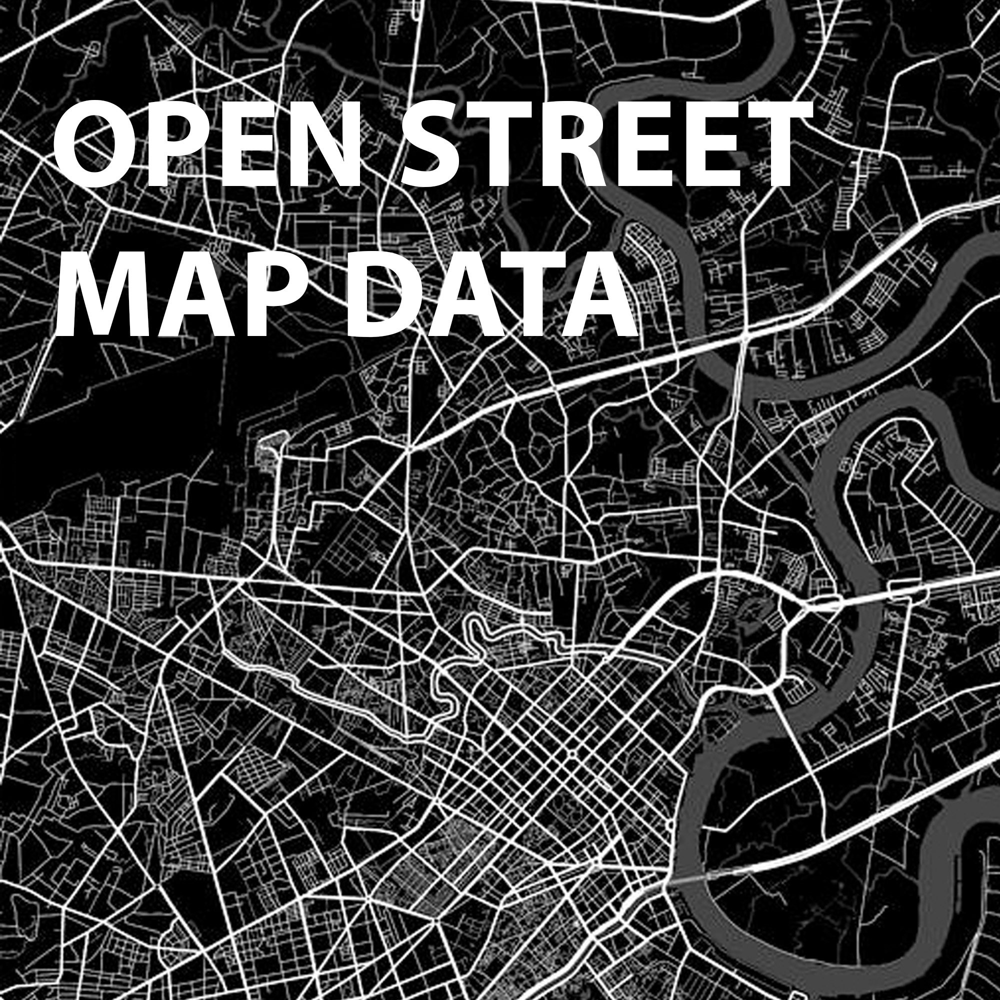

# **rspatialdata** is a collection of data sources and tutorials on visualising spatial data using R

Open and reliable data and analytical tools as well as collaborative research are crucial for solving global challenges and achieving sustainable development. In this website we provide a collection of data sources and tutorials on downloading and visualising spatial data using R.
The website is currently in construction and includes tutorials on how to download and visualise administrative boundaries, Open Street Map data, population and malaria data. If you have suggestions about datasets or R packages or would like to contribute, please [get in touch](contributors.html).

  

  

  

  
  

  

  
  

  

  
  

  

  
  

  

  
  

  

  

  

  

  
  

  

  
  

  

  
  

  

  
  

  

  
  

  

  
  

  

